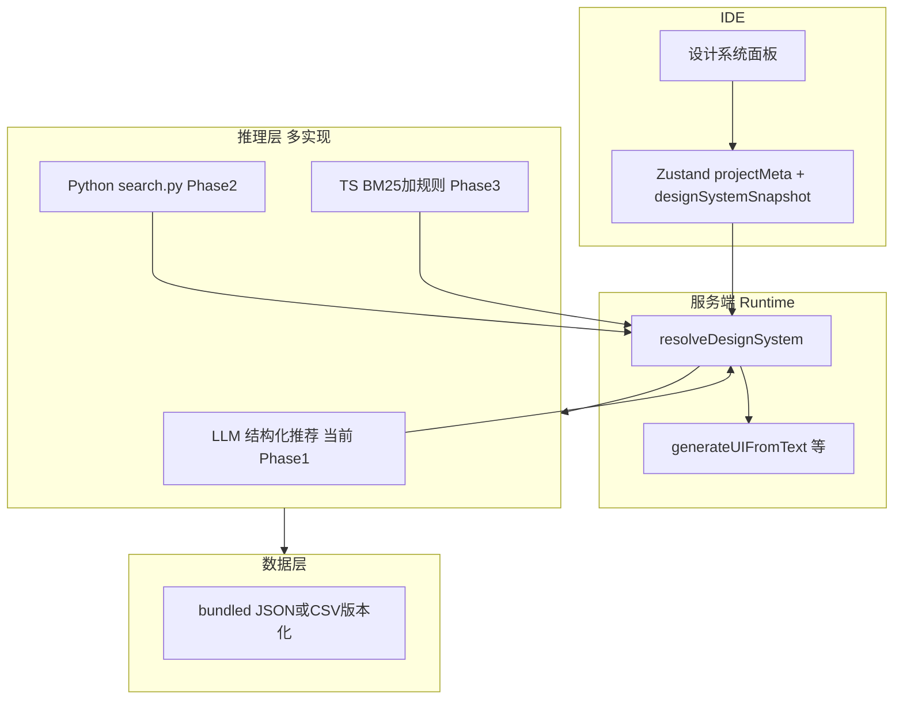

# 设计系统与 UIUXProMax 对齐 — 长期完整总方案

> **文档角色**：单一事实来源（SSOT），描述从当前能力到与 [UIUXProMax / ui-ux-pro-max-skill](https://github.com/nextlevelbuilder/ui-ux-pro-max-skill) **能力对齐**的完整路径。  
> **增量说明**：Phase 1 实现细节见 [DESIGN_SYSTEM_AUTO_ROADMAP.md](./DESIGN_SYSTEM_AUTO_ROADMAP.md)；风格策略背景见 [STYLE_PRESET_VS_UIUXPROMAX.md](./STYLE_PRESET_VS_UIUXPROMAX.md)。

---

## 1. 目标与终局定义

### 1.1 业务目标

- **单一事实来源**：项目的视觉与交互规范（色板、字体气质、版式 Pattern、反模式）可被**计算、存储、版本化**，并驱动 **建图、单页 UI 生成、静态 HTML 轨、PRD/导出文档**。
- **对齐开源能力**：在推荐质量与可复现性上接近 UIUXProMax v2 的 *Design System Generator*（多域检索 + 行业规则 + 反模式），而非仅一段静态 Markdown 提示词。
- **可控与可覆盖**：用户可 **采纳 / 覆盖 / 锁定** 推荐结果；支持 **审计与回滚**。

### 1.2 终局能力清单（验收口径）

| 能力 | 说明 |
|------|------|
| **推理可复现** | 相同「项目画像 + 版本化规则集」输入 → 相同或可追溯差异的设计系统输出（TS 引擎或固定种子）。 |
| **多域数据** | 产品类型、风格库、色板、字体对、落地页 Pattern、行业 Anti-patterns 等数据 **版本号化**（如 `uupm-data@x.y.z`）。 |
| **项目快照** | `DesignSystemSnapshot` 持久化在画布/项目 store 或后端；含 `source`（llm / python / ts-engine）、`payload`、更新时间。 |
| **全链路消费** | `generateUIFromText`、`generateStaticUIFromText`（如需要）、`generateGraph`（可选轻量风格提示）、导出 PRD/HTML **均可读取当前快照或实时解析**。 |
| **IDE 体验** | 画布或工具栏内 **设计系统面板**：展示当前推荐、手动编辑覆盖、查看历史版本。 |
| **部署无 Python 可选** | 生产环境可走 **纯 TS 路径**；Python 仅作开发校验或可选微服务。 |

---

## 2. 总体架构



**依赖方向**（与 AGENTS.md 一致）：`src/types`（zod）→ `src/lib/design-system`（纯函数/引擎）→ `src/app/actions`（Server Actions）→ UI。

---

## 3. 核心数据模型（建议 zod，终局落地）

以下为 **目标 schema**，可分阶段实现；字段可随迭代增减。

```typescript
// 建议路径：src/types/design-system-snapshot.ts（待建）

DesignSystemSnapshot = z.object({
  schemaVersion: z.literal(1), // 递增迁移
  engineVersion: z.string(),   // 如 uupm-data@2.0.1 或 app@1.0.0
  source: z.enum(['llm_draft', 'python_uupm', 'ts_engine', 'manual_override']),
  createdAt: z.string().datetime(),
  contextHash: z.string().optional(), // 输入指纹，用于缓存

  pattern: z.object({
    summary: z.string(),
    sections: z.array(z.string()).optional(),
  }),
  style: z.object({
    name: z.string(),
    keywords: z.array(z.string()),
  }),
  colors: z.object({
    primary: z.string(),
    secondary: z.string(),
    cta: z.string(),
    background: z.string(),
    text: z.string(),
    notes: z.string().optional(),
  }),
  typography: z.string(),
  keyEffects: z.string(),
  antiPatterns: z.array(z.string()),

  /** 注入 LLM 的 Markdown 缓存，避免重复推理 */
  markdownBlock: z.string().optional(),
});
```

**持久化**：与现有 `projectMeta`、`nodes` 一并进入画布持久化（见 `canvas-store` export）；或后续引入服务端项目 DB。

---

## 4. 分阶段实施计划（完整拆解）

### Phase 0 — 基线（已完成）

| 项 | 状态 |
|----|------|
| `UI_UX_PRO_MAX_GUIDANCE` 作为全局设计底线 | 已有 |
| 多风格 `STYLE_PRESET` + enforcement | 已有 |
| 禁止裸 `Icon`、Lucide 具名等预览约束 | 已有（LivePreview + prompt） |

---

### Phase 1 — 智能推荐（MVP，已实现）

| 交付物 | 说明 |
|--------|------|
| `stylePreset === 'auto'` | 不锁固定 Tailwind 预设 |
| `recommendDesignSystemMarkdown` | 单次 LLM → 结构化 JSON → Markdown 注入 `generateUIFromText` |
| `AI_DESIGN_SYSTEM_RECOMMEND=0` | 关闭推荐 LLM |

**验收**：同描述下 `auto` 与 `corporate` 可区分；关环境变量无二次 LLM。

**文档**：[DESIGN_SYSTEM_AUTO_ROADMAP.md](./DESIGN_SYSTEM_AUTO_ROADMAP.md)

---

### Phase 2 — 官方 Python 引擎对接（高保真对齐）

| 目标 | 与 UIUXProMax README 中 `search.py --design-system` 行为一致或子集一致 |
|------|------------------------------------------------------------------------|
| **交付物** | Vendor 或 git submodule：`scripts/search.py` + 数据目录；`UIUXPROMAX_ROOT`、`spawn` 封装；`resolveDesignSystem` 优先 Python，失败降级 LLM |
| **涉及路径** | `src/lib/design-system/run-uupm-python.ts`（新）、`node-operations.ts`、`环境变量文档` |
| **部署** | **方案 A**：Docker/VM 同机 Node+Python；**方案 B**：独立 Python 微服务 HTTP；**方案 C**：Vercel 仅用预计算 JSON 子集（降级） |
| **验收** | 固定 3 组 query，Python 输出与上游 CLI 对比一致（快照测试） |

**风险**：Serverless 冷启动、包体积、许可证（遵循上游 ISC 等）。

---

### Phase 3 — TypeScript 推理引擎（生产主路径）

| 目标 | 去掉 Python 运行时依赖，行为与 Phase 2 对齐或可接受偏差文档化 |
|------|----------------------------------------------------------------|
| **交付物** | `src/lib/design-system/engine/`：BM25 或等价检索、多域合并、JSON 规则解析；数据自 `public/design-system-data/` 或包内 import |
| **交付物** | 黄金用例集：`scripts/verify-design-system-engine.ts`（CI） |
| **验收** | CI 中 ≥N 条用例与 Phase 2 输出 **结构一致**（色板/风格名允许小幅差异，需阈值） |

**工作量**：中到大；建议在 Phase 2 验证业务价值后再全力投入。

---

### Phase 4 — 快照持久化与全链路

| 目标 | 设计系统成为项目资产，而非每次现算 |
|------|-----------------------------------|
| **交付物** | `DesignSystemSnapshot` 写入 store + 持久化；**重新解析**按钮（行业/描述变更时） |
| **交付物** | `generateUIFromText`：**有快照则优先注入快照 Markdown**；无快照再走 resolve |
| **交付物** | `generateStaticUIFromText`：可选注入同一段或缩短版 |
| **交付物** | `prdGenerator` / 导出 HTML：附录「当前设计系统」 |
| **验收** | 刷新页面后 UI 生成仍使用上次锁定快照（若用户未点重新解析） |

---

### Phase 5 — IDE 产品化与运营

| 目标 | 可发现、可编辑、可协作 |
|------|------------------------|
| **交付物** | **设计系统面板**：只读展示 + 反模式高亮 + 手动覆盖字段 |
| **交付物** | **历史版本**：最近 K 次快照 diff（文本 diff 即可） |
| **交付物** | **观测**：`resolveDesignSystem` 耗时、source 分布、失败率（日志或埋点） |
| **交付物** | **成本**：LLM 路径缓存 key = `contextHash`；TS 路径近乎零边际成本 |

---

## 5. 与现有代码映射表

| 模块 | 当前 | 终局 |
|------|------|------|
| 风格枚举 | `src/types/theme.ts` | 保留 `auto` + 预设；快照可存 `styleKeywords` 冗余 |
| UI 生成注入 | `node-operations.ts` `generateUIFromText` | 注入顺序：`[用户锁定快照] > [引擎输出] > themeConfig > UI_UX_PRO_MAX` |
| LLM 推荐 | `recommend-design-system.ts` | 降级路径 + 可选写入快照 |
| 静态 HTML 轨 | `ui-pipeline-new.ts` | 与主轨共享 `resolveDesignSystem` 或快照片段 |
| 导出 | `prdGenerator.ts` 等 | 增加设计系统附录 |

---

## 6. 里程碑建议（可按季度调整）

| 季度 | 里程碑 |
|------|--------|
| Q1 | Phase 1 稳定 + Phase 2 Spike（Python 在一台机器跑通） |
| Q2 | Phase 2 生产试点 或 Phase 3 α（TS 引擎 + 10 条黄金用例） |
| Phase 4 | 快照 + PRD 导出 |
| Phase 5 | 面板 + 观测 |

---

## 7. 风险与依赖

| 风险 | 缓解 |
|------|------|
| 上游 skill 数据结构变更 | `engineVersion` 锁版本；CI 对比 |
| LLM 推荐不稳定 | Phase 4 锁定快照；Phase 3 主路径 |
| Token 成本 | 缓存、仅 `auto` 或「重新解析」时调用 LLM |
| 多语言项目 | 快照与 prompt 保持中文 UI 要求与现有规范一致 |

---

## 8. 文档维护

- **重大阶段完成**：更新本节「Phase X — 状态：已完成」并链接 PR。  
- **AGENTS.md**：索引本文件为设计系统总方案。  
- **ADR**：若引入 Python 微服务或数据子模块，建议新增 ADR。

---

## 9. 相关链接

- [DESIGN_SYSTEM_DEV_CONSTRAINTS.md](./DESIGN_SYSTEM_DEV_CONSTRAINTS.md) — 开发约束补篇（实现级 C-001～C-014、DoD、PR 清单）  
- [DESIGN_SYSTEM_AUTO_ROADMAP.md](./DESIGN_SYSTEM_AUTO_ROADMAP.md) — Phase 1 细节与分支说明  
- [STYLE_PRESET_VS_UIUXPROMAX.md](./STYLE_PRESET_VS_UIUXPROMAX.md) — 预设 vs 开源对比  
- [ui-ux-pro-max-guidance.ts](../src/lib/prompts/ui-ux-pro-max-guidance.ts) — 全局设计底线文案
